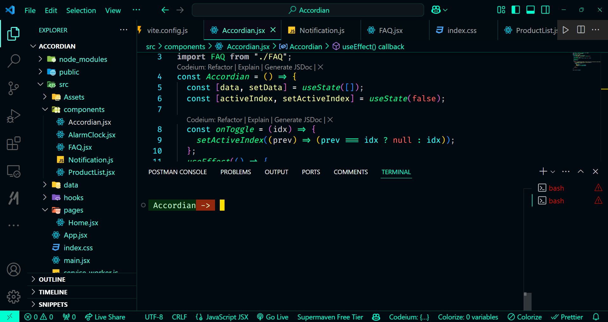
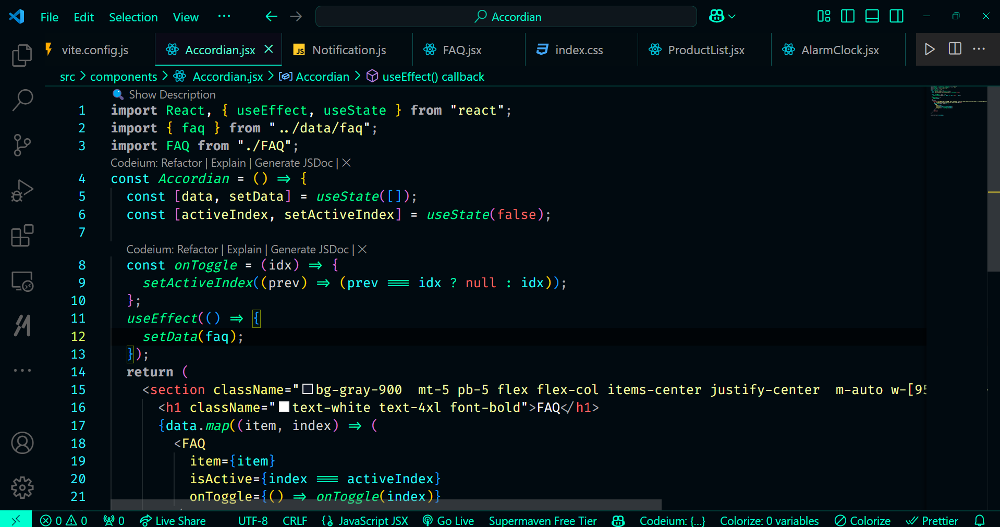
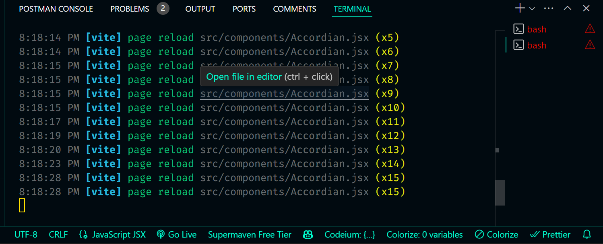

# bhupeshb7-coder-dark-theme

bhupeshb7-coder-dark-theme is a sleek and modern dark theme for Visual Studio Code. It is designed to reduce eye strain and improve code readability with a carefully chosen color palette.

## Installation

1. Open the Extensions sidebar in VS Code.
2. Search for `bhupeshb7-coder-dark-theme`.
3. Click **Install**.
4. Click **Reload** to activate the theme.

Alternatively, you can manually install the theme:

1. Download the latest release of the theme from the [GitHub repository](https://github.com/your-repo).
2. Unzip the downloaded file and copy the contents to the `.vscode/extensions` directory.

## Features

- Dark background with high-contrast colors
- Easy on the eyes, suitable for long coding sessions
- Consistent color scheme for better focus

## Color Palette

| Element                         | Color      |
|---------------------------------|------------|
| Activity Bar Background         | #010A10    |
| Activity Bar Border             | #010A1060  |
| Activity Bar Foreground         | #5fffe7    |
| Editor Background               | #010A10    |
| Editor Foreground               | #FFFFFF    |
| Editor Line Highlight Background | #00000090 |
| Editor Selection Background     | #FFE00040  |
| Editor Cursor Foreground        | #FFE000    |
| ...                             | ...        |

## Token Colors

| Scope                                  | Color      | Font Style |
|----------------------------------------|------------|------------|
| Variable, String Placeholder           | #00ffbb    |            |
| Invalid Deprecated, Keyword, Storage   | #00ff95    | Italic     |
| Entity Name Function                   | #00ff95    | Italic     |
| Punctuation Interpolation              | #FF0C0C    |            |
| ...                                    | ...        | ...        |

## Demo Images

Here are some demo images to showcase the theme in action:

## Contributing

If you have suggestions for improving the theme, please feel free to submit an issue or a pull request on the [GitHub repository](https://github.com/your-repo).

## License

This theme is licensed under the [MIT License](LICENSE).

