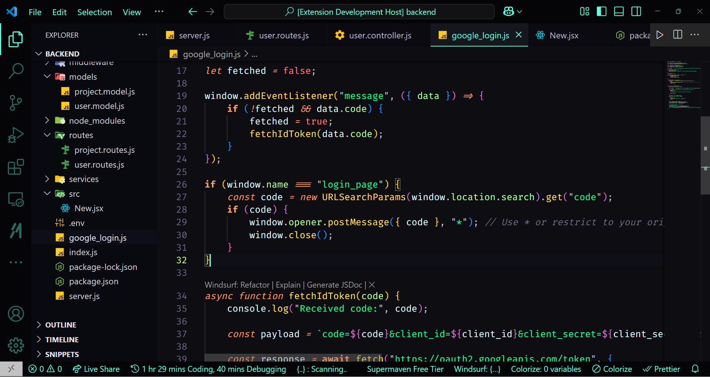
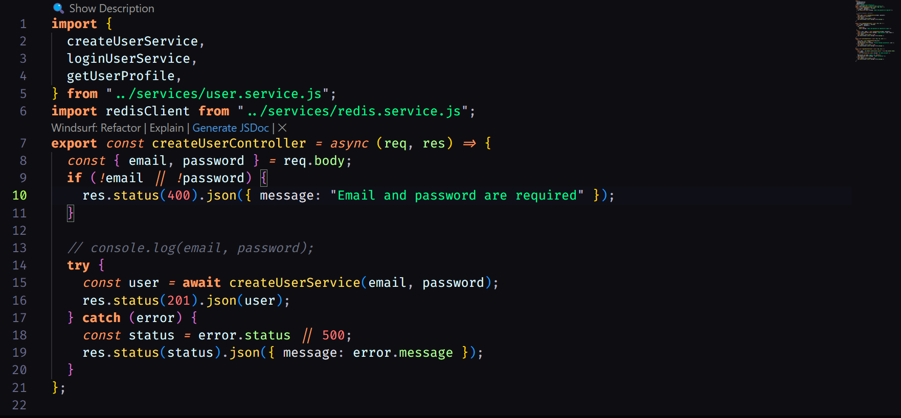

# Bhupesh B7 Coder Dark Theme


A sleek, modern dark theme for Visual Studio Code optimized for long coding sessions with carefully selected colors that reduce eye strain while enhancing code readability.



Editor preview




## Features

- **Deep Dark Background**: Elegant midnight blue-black base (#0e0e12) to reduce eye strain
- **Vibrant Syntax Highlighting**: Carefully chosen color palette with high contrast for optimal readability
- **Cohesive UI**: Unified design across all VS Code interface elements
- **Subtle Accents**: Teal (#5cffdd) accents for important UI elements provide visual cues without distraction
- **Thoughtful Typography**: Italic style for keywords and bold for control flow statements

## Color Palette

### Editor UI Colors

| UI Element | Color Code | Description |
|------------|------------|-------------|
| Editor Background | `#0e0e12` | Main editor background |
| Editor Foreground | `#e2e2e9` | Default text color |
| Sidebar Background | `#090910` | File explorer background |
| Activity Bar | `#050508` | Left sidebar background |
| Status Bar | `#050508` | Bottom status bar |
| Selection Background | `#3b3b5a60` | Selected text highlight |
| Line Highlight | `#10101c90` | Current line highlight |
| Cursor | `#5cffdd` | Text cursor |
| Active Line Number | `#b8ff65` | Current line number |

### Token Colors

| Syntax Element | Color Code | Usage |
|----------------|------------|-------|
| Keywords | `#ff9d60` | Programming language keywords |
| Functions | `#ffdf5d` | Function names and calls |
| Strings | `#00ff95` | String literals |
| Numbers/Constants | `#ff7d7d` | Numeric values and constants |
| Properties | `#b5ff9d` | Object properties and parameters |
| Variables | `#def7ff` | Variable names |
| HTML/JSX Tags | `#5cffdd` | Markup language tags |
| Comments | `#6d7180` | Code comments |
| Types/Classes | `#ffee97` | Class names and type definitions |

### Language-Specific Colors

| Language | Element | Color Code |
|----------|---------|------------|
| **JavaScript/TypeScript** | Keywords | `#ff9d60` |
| | Functions | `#ffdf5d` |
| | Properties | `#b5ff9d` |
| | Strings | `#00ff95` |
| | Variables | `#def7ff` |
| **HTML** | Tags | `#5cffdd` |
| | Attributes | `#ffee97` |
| **CSS** | Properties | `#82e2ff` |
| | Values | `#b5ff9d` |
| | Selectors | `#ffee97` |
| **JSON** | Property Names | `#82e2ff` |
| | Values | `#e095ff` |
| **C/C++** | Keywords | `#ff9d60` |
| | Types | `#ffee97` |
| | Macros | `#ffdf5d` |
| | Strings | `#00ff95` |

## Language Optimizations

This theme has been carefully optimized for optimal syntax highlighting across multiple languages:

### Web Development
- JavaScript/TypeScript with distinct styling for keywords, functions, and variables
- HTML/JSX with vibrant tag highlighting and attribute colors
- CSS/SCSS/LESS with intuitive property and value coloring
- JSON with clear distinction between keys and values

### Programming Languages
- Python with clean function and class highlighting
- C/C++ with distinct colors for types, macros, and keywords
- Java with enhanced class and method visibility
- PHP with improved variable and function highlighting

### Other Formats
- Markdown with prominent headings and link styling
- YAML/XML with clear structure highlighting
- Regular expressions with enhanced pattern visibility

## Installation

1. Open **Extensions** sidebar in VS Code (`Ctrl+Shift+X` or `Cmd+Shift+X`)
2. Search for `bhupeshb7-coder-dark-theme`
3. Click **Install**
4. Click **Reload** to reload VS Code
5. From the menu bar click: Code > Preferences > Color Theme > **Bhupesh B7 Coder Dark Theme**

## Recommended Settings

For the best experience with this theme, consider these additional settings:

```json
{
  "editor.fontFamily": "'Fira Code', 'Droid Sans Mono', 'monospace'",
  "editor.fontLigatures": true,
  "editor.fontSize": 14,
  "editor.lineHeight": 24,
  "editor.bracketPairColorization.enabled": true
}
```

## Feedback & Contributions

If you have suggestions or find any issues, please submit them through the [GitHub repository](https://github.com/bhupeshb7/coder-dark-theme/issues).

Pull requests are welcome! If you'd like to contribute, please feel free to fork the repository and submit a pull request.

 
---

**Enjoy coding with the Bhupesh B7 Coder Dark Theme!** 💻✨